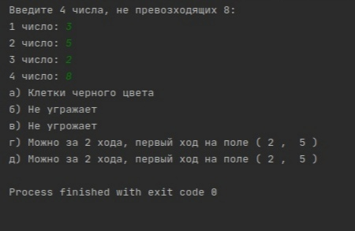
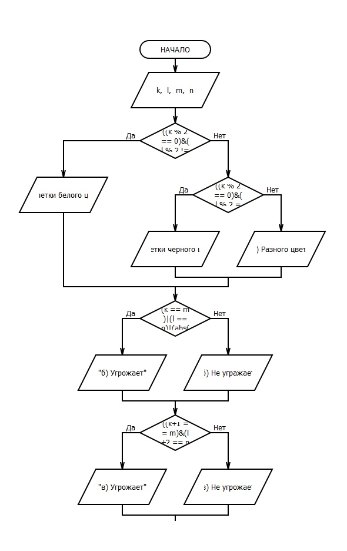
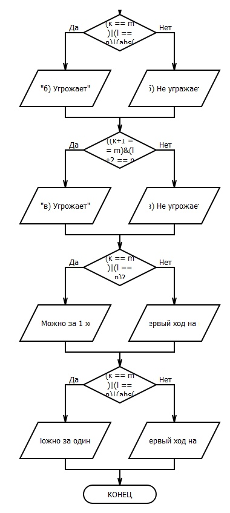

Есть шахматная доска и даны 4 числа(k, l, m, n). Данная программа выясняет:
    a) являются ли поля(k, l) и (m, n) полями одного цвета
    б) Угражает ли ферзь (k, l) полю (m, n)
    в) Угрожает ли конь (k, l) полю (m, n)
    г) можно ли с пол (k, l) одним ходом ладьи попасть на поле (m, n). Если нет, то выяснить, как это можно сделать за два хода (указать поле, на которое приводит первый ход)
    д) можно ли с поля (k, I) одним ходом ферзя попасть на поле (m, n). Если нет, то выяснить, как это можно сделать за два хода (указать поле, на которое приводит первый ход)
    е) можно ли с поля (k, I) одним ходом слона попасть на поле (m, n). Если нет, то выяснить, как это можно сделать за два хода (указать поле, на которое приводит первый ход)

    Скриншот работы программы:
    
    
    
    Блок-схема программы:
    
    
    
    
    
    
    Проект можно открыть в среде программирования Pycharm. Файл написан на языке Python.
    Открывать файл "laba11-12.py"
    
    
